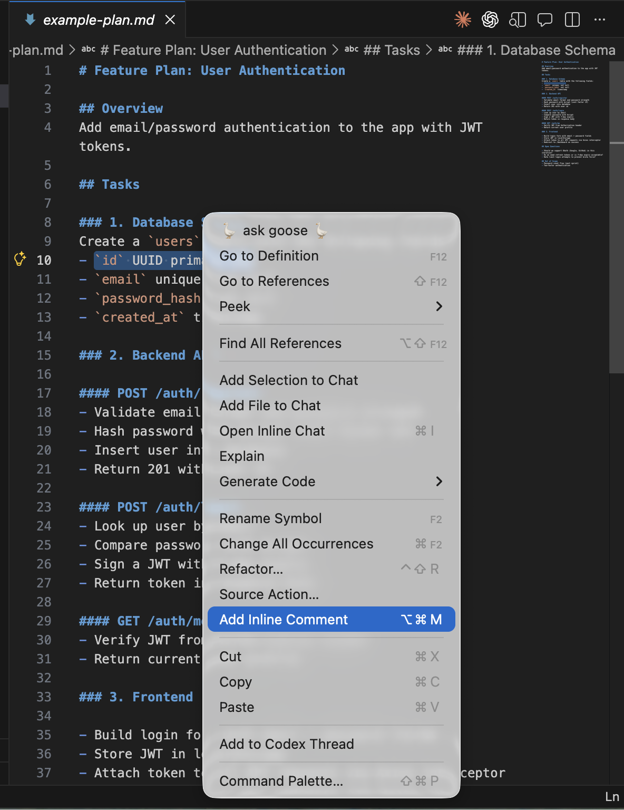
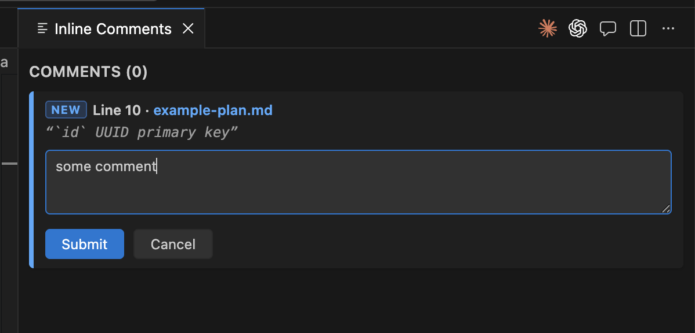
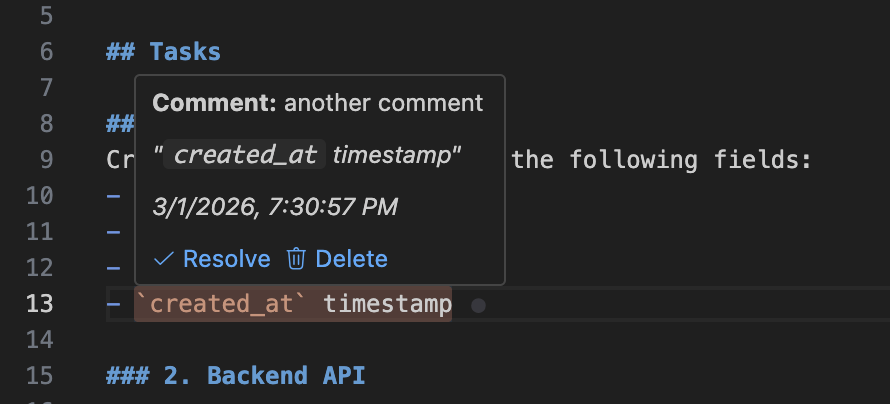

# Inline Commenting for VS Code

Add comments to highlighted text — just like Google Docs, right inside your editor.

---

## How It Works

**1. Highlight text → right-click → Add Inline Comment** (or `Cmd+Alt+M`)



**2. Type your comment in the panel and submit**



**3. Hover the highlight to read, resolve, or delete**



---

## Features

- **Highlight any text** and add a comment with a keyboard shortcut or right-click
- **Compact comment panel** — all comments in a scrollable sidebar, sorted by file and line
- **Hover** over highlighted text to read the comment, resolve it, or delete it inline
- **Resolve** comments with a checkbox — they dim in place without jumping the panel
- **Edit** comment text inline — updates in place without a page reload
- **Delete** from the panel — card disappears instantly
- **Persisted** across sessions in `.vscode/inline-comments.json` — commit it to share with your team

---

## Usage

| Action | How |
|---|---|
| Add comment | Highlight text → `Cmd+Alt+M` (Mac) / `Ctrl+Alt+M` (Win/Linux) |
| Add comment | Highlight text → right-click → **Add Inline Comment** |
| View all comments | Command Palette → **Inline Comment: Show All Comments** |
| Delete a comment | Hover card → click **✕** — or — Command Palette → **Inline Comment: Delete Inline Comment** |
| Resolve a comment | Hover card → check the checkbox — or — hover highlighted text → click **Resolve** |
| Edit a comment | Hover card → click **✎** |
| Clear everything | Command Palette → **Inline Comment: Clear All Comments** |

---

## Editor Decorations

| State | Decoration |
|---|---|
| Active comment | Yellow highlight + `●` glyph |
| Resolved comment | Dimmed highlight + `✓` glyph |

---

## Data Storage

Comments are saved to `.vscode/inline-comments.json` in your workspace root. Add it to version control to share annotations with teammates.

---

## Development

```bash
git clone https://github.com/realkenlee/vscode-in-line-commenting.git
cd vscode-in-line-commenting
npm install
npm run compile
# Press F5 in VS Code to launch the Extension Development Host
```

The `.vscode/launch.json` and `.vscode/tasks.json` are included so F5 works out of the box.

---

## Known Limitations

- Comment ranges are anchored to line/character positions at the time of creation. If lines are inserted or deleted *before* a commented range, the decoration will shift.
- Multi-root workspaces use the first workspace folder as the storage root.
- The split-panel ratio is controlled by dragging the VS Code divider — there is no API to set it programmatically.

---

## License

MIT
